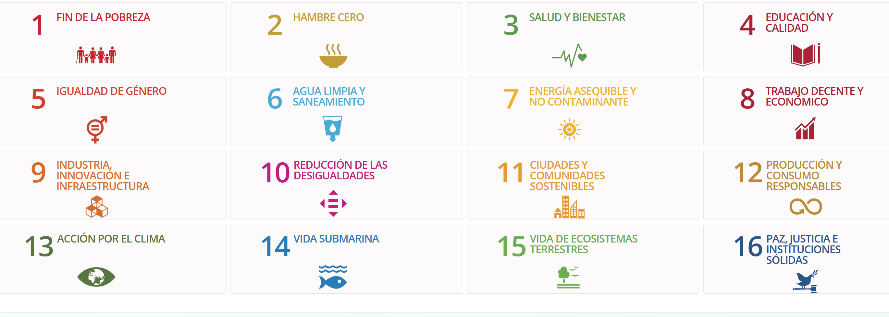

# Ikerketa-txostena: Open Data Euskadiko APIen Ekosistemaren Ebaluazio Tekniko Zehatza eta Balio Proposamena

- [Ikerketa-txostena: Open Data Euskadiko APIen Ekosistemaren Ebaluazio Tekniko Zehatza eta Balio Proposamena](#ikerketa-txostena-open-data-euskadiko-apien-ekosistemaren-ebaluazio-tekniko-zehatza-eta-balio-proposamena)
  - [1. Sarrera eta Testuinguru Estrategikoa](#1-sarrera-eta-testuinguru-estrategikoa)
  - [2. Azpiegituraren Analisia eta Elkarreragingarritasun-paradigmak](#2-azpiegituraren-analisia-eta-elkarreragingarritasun-paradigmak)
    - [2.1 REST Arkitektura eta Web Zerbitzuak](#21-rest-arkitektura-eta-web-zerbitzuak)
    - [2.2 Serializazio-formatuak eta Datu-estandarrak](#22-serializazio-formatuak-eta-datu-estandarrak)
    - [2.3 Web Semantikoa eta Linked Open Data (LOD)](#23-web-semantikoa-eta-linked-open-data-lod)
    - [2.4 Segurtasun-ereduak eta Autentifikazioa](#24-segurtasun-ereduak-eta-autentifikazioa)
  - [3. APIen Katalogoaren Auditoria Zehatza Sektoreka](#3-apien-katalogoaren-auditoria-zehatza-sektoreka)
    - [3.1 Ingurumen eta Meteorologiaren Esparrua](#31-ingurumen-eta-meteorologiaren-esparrua)
      - [3.1.1 Euskalmeten APIa (Euskal Meteorologia Agentzia)](#311-euskalmeten-apia-euskal-meteorologia-agentzia)
      - [3.1.2 Airearen Kalitatearen APIa](#312-airearen-kalitatearen-apia)
      - [3.1.3 Polen Neurketen APIa](#313-polen-neurketen-apia)
      - [3.1.4 Uren APIa (Kontsumoa eta Ur-masak)](#314-uren-apia-kontsumoa-eta-ur-masak)
    - [3.2 Mugikortasunaren eta Garraioaren Esparrua](#32-mugikortasunaren-eta-garraioaren-esparrua)
      - [3.2.1 Trafiko APIa](#321-trafiko-apia)
      - [3.2.2 Moveuskadi (Planifikatzailea eta Garraio Publikoko Datuak)](#322-moveuskadi-planifikatzailea-eta-garraio-publikoko-datuak)
    - [3.3 Esparru Sozioekonomikoa eta Kulturala](#33-esparru-sozioekonomikoa-eta-kulturala)
      - [3.3.1 Kontratazio Publikoaren APIa](#331-kontratazio-publikoaren-apia)
      - [3.3.2 Kultur Ekitaldien APIa (Kulturklik)](#332-kultur-ekitaldien-apia-kulturklik)
      - [3.3.3 Turismoaren eta Baliabide Turistikoen APIa](#333-turismoaren-eta-baliabide-turistikoen-apia)
      - [3.3.4 Estatistika APIak (Eustat eta Udalmap)](#334-estatistika-apiak-eustat-eta-udalmap)
    - [3.4 Beste Zerbitzu Garrantzitsu Batzuk](#34-beste-zerbitzu-garrantzitsu-batzuk)
  - [4. Irtenbide-arkitekturak: Aplikazio Proposamenak eta Erabilera Kasuak](#4-irtenbide-arkitekturak-aplikazio-proposamenak-eta-erabilera-kasuak)
    - [Erabilera Kasua 1: Mugikortasun Pertsonal Osasungarriko Plataforma ("BreatheSafe Euskadi")](#erabilera-kasua-1-mugikortasun-pertsonal-osasungarriko-plataforma-breathesafe-euskadi)
    - [Erabilera Kasua 2: Kokapen-adimeneko Tresna Inbertitzaileentzat ("Gastro-Market Insight")](#erabilera-kasua-2-kokapen-adimeneko-tresna-inbertitzaileentzat-gastro-market-insight)
    - [Erabilera Kasua 3: Azpiegitura Kritikoen Erresilientzia Kudeatzeko Sistema](#erabilera-kasua-3-azpiegitura-kritikoen-erresilientzia-kudeatzeko-sistema)
    - [Erabilera Kasua 4: Lege Laguntzaile Adimenduna Kontratazio Publikorako](#erabilera-kasua-4-lege-laguntzaile-adimenduna-kontratazio-publikorako)
    - [Erabilera Kasua 5: Gizarte Preskripzioko eta Osasun Aktiboetako Plataforma ("Euskadi Aktiboa Digital")](#erabilera-kasua-5-gizarte-preskripzioko-eta-osasun-aktiboetako-plataforma-euskadi-aktiboa-digital)
  - [5. Erronka Teknikoak eta Inplementaziorako Gomendioak](#5-erronka-teknikoak-eta-inplementaziorako-gomendioak)
    - [5.1 Latentziaren Kudeaketa eta Cachea](#51-latentziaren-kudeaketa-eta-cachea)
    - [5.2 Homogeneizazio Semantikoa](#52-homogeneizazio-semantikoa)
    - [5.3 Pribatutasuna eta Etika](#53-pribatutasuna-eta-etika)
    - [5.4 Gakoen Mantentze-lana eta Segurtasuna](#54-gakoen-mantentze-lana-eta-segurtasuna)
  - [6. Ondorioa](#6-ondorioa)

## 1. Sarrera eta Testuinguru Estrategikoa

Euskal administrazio digitalaren bilakaerak informazio estatikoaren argitalpen hutsetik datu irekien azpiegitura dinamiko eta elkarreragingarri baten sendotzerantz egin du. Open Data Euskadi ataria, Eusko Jaurlaritzaren menpekoa, ez da soilik gardentasun-biltegi bat bezala eraikitzen, baizik eta zerbitzu digitalen nodo kritiko gisa ere, beste sistema administratibo batzuk, enpresa pribatuak eta herritarrak oro har elikatzen dituena. Txosten honen helburua katalogo horretan eskuragarri dauden Aplikazioen Programazio Interfazeen (API) arkitektura teknikoa aztertzea eta aktibo horiek ustiatzeko irtenbide-arkitekturak proposatzea da, balio sozioekonomikoa sortzeko.

Datuaren ekonomiaren egungo testuinguruan, sarbide automatizatuko mekanismoen (APIak) eskuragarritasunak, fitxategien eskuzko deskargaren (CSV, XLS) aurrean, datu-atari pasibo baten eta denbora errealeko berrikuntza-ekosistema baten arteko aldea markatzen du. Katalogoaren dokumentazio teknikoaren eta metadatuen gainean egindako ikerketak¹ agerian uzten du konpromiso instituzionala dagoela estandar irekiekin (REST, JSON, XML, RDF) eta kritikotasun handiko domeinuekin, hala nola meteorologiarekin, mugikortasunarekin eta ingurumen-osasunarekin.

Dokumentu hau bi bloke handitan egituratzen da. Lehenengoak identifikatutako API zerbitzu bakoitzaren auditoria tekniko zehatza egiten du, protokoloak, serializazio-formatuak, eguneratze-maiztasuna eta segurtasun-ereduak aztertuz. Bigarren blokeak aplikazio praktikoko proposamen batzuk (erabilera-kasuak) garatzen ditu, non datu-iturri anitz integratzen dituzten irtenbide teorikoak diseinatzen diren, mugikortasun jasangarrian, merkatu-adimenean eta larrialdien kudeaketan arazo konplexuak konpontzeko.

## 2. Azpiegituraren Analisia eta Elkarreragingarritasun-paradigmak

Zerbitzu bakoitzaren xehetasunetara jaitsi aurretik, ezinbestekoa da Open Data Euskadiren datu-eskaintza sostengatzen duten oinarri teknologikoak ulertzea. Datuen heterogeneotasunak —denbora errealeko sentsoreen neurketetatik hasi eta urteko erregistro administratiboetaraino— ikuspegi hibridoa hartzera behartu du informazioaren banaketan.

### 2.1 REST Arkitektura eta Web Zerbitzuak

Open Data Euskadiko sarbide programatikoaren bizkarrezurra REST (Representational State Transfer) arkitekturan oinarritzen da. Paradigma horrek, software modernoaren industriako *de facto*-ko estandarra denak, garatzaileei datu-baliabideekin (izan trafiko-gorabeherak edo airearen kalitatearen neurketak) HTTP eragiketa estandarren bidez (nagusiki GET informazioa kontsultatzeko) elkarreragiteko aukera ematen die.

Dokumentatutako amaiera-puntuen (endpoints) analisiak² URL semantiko eta aurreikusgarrien aldeko lehentasuna erakusten du, eta horrek integratzaileen ikasketa-kurba errazten du. Adibidez, trafikoko edo meteorologiako zerbitzuetarako deiak kokapen geografikoaren, sentsore motaren edo denbora-leihoaren arabera iragaztea ahalbidetzen duten kontsulta-parametroen (query parameters) bidez egituratu ohi dira. Jatorrian iragazteko gaitasun hori funtsezkoa da mugikorretarako aplikazioetan latentzia eta banda-zabaleraren kontsumoa murrizteko, eta azpimultzo espezifiko bat baino behar ez denean datu-multzo masiboen transferentzia saihesteko.

### 2.2 Serializazio-formatuak eta Datu-estandarrak

Elkarreragingarritasun teknikoa irudikapen-formatu anitzak onartuz bermatzen da. Katalogoaren metadatuen ikerketak¹ honako estandar nagusi hauek identifikatzen ditu:

* **JSON (JavaScript Object Notation):** API berri gehienetarako (Airearen Kalitatea, Garraioa, Turismoa) lehentasunezko formatu gisa finkatu da. Bere arintasunari eta nabigatzaileek zein mugikorretarako aplikazioek natiboki interpretatzeko gaitasunari esker, aproposa da bezero arinak garatzeko.
* **XML (Extensible Markup Language):** Presentzia handia mantentzen du, batez ere ibilbide historiko luzea duten zerbitzuetan edo eskema-balidazio zorrotzak behar dituztenetan, hala nola trafiko-gorabeheren zerbitzuan edo edukien sindikazioan (RSS).
* **GeoJSON:** Euskal administrazioaren lurralde-izaera dela eta, osagai geoespaziala nonahi dago. GeoJSON formatua turismo-baliabideen, ingurumenaren eta garraioaren zerbitzuetan estentsiboki erabiltzen da geometria konplexuak (interes-puntuak, ibilbideen trazaketak, babestutako eremuetako poligonoak) eta haien atributu deskribatzaileak irudikatzeko.⁵
* **Domeinu Espezifikoko Formatuak (GTFS, SIRI):** Garraio publikoaren arloan, Open Data Euskadik ez du gurpila berrasmatzen, baizik eta estandar globalak hartzen ditu. GTFS (General Transit Feed Specification) eta GTFS-RT (Real-Time) formatuen presentziak⁶ mugikortasuneko elkarreragingarritasunaren abangoardian jartzen du Euskadi, eta bere datuak Google Maps, Apple Maps edo Citymapper bezalako ibilbide-planifikatzaile globalek kontsumitu ahal izatea ahalbidetzen du, *ad hoc* egokitzapenen beharrik gabe.

### 2.3 Web Semantikoa eta Linked Open Data (LOD)

Euskadiko datu-estrategiaren alderdi bereizgarri bat Web Semantikoaren aldeko apustu irmoa da. Ohiko REST APIez harago, atariak SPARQL Puntu bat eskaintzen du.³ SPARQL RDF (Resource Description Framework) datu-baseetarako kontsulta-lengoaia da, W3C-k estekatutako datuen weberako (Linked Data) ezarritako estandarra.

Sarbide-puntu hori egoteak⁸ esan nahi du gobernuaren datu asko ezagutza-grafo gisa modelatuta daudela. Horrek REST API tradizional batekin ezinezkoak izango liratekeen konplexutasun-mailako kontsultak egitea ahalbidetzen du. Adibidez, REST API batek "Zein dirulaguntza daude?" galderari erantzun diezaiekeen bitartean, ondo formulatutako SPARQL kontsulta batek honako hau erantzun lezake: "Kulturako zer dirulaguntza eman dira %10etik gorako langabezia-tasa duten 5.000 biztanle baino gutxiagoko udalerrietan?", dirulaguntzen, udal-erroldaren eta enplegu-estatistiken datuak eskaera bakarrean gurutzatuz. Datuen sarbidean dagoen "adimen" maila hori balio kalkulaezineko aktiboa da ikertzaileentzat eta politika publikoen analistentzat.

### 2.4 Segurtasun-ereduak eta Autentifikazioa

Dokumentazioaren analisiak dikotomia bat erakusten du segurtasun-ereduetan. Katalogoko API gehienak (Turismoa, Kultura, Oinarrizko Trafikoa) sarbide irekikoak dira, eta ez dute autentifikaziorik behar edo, gehienez ere, gako sinpleak erabiltzen dituzte kuotak kontrolatzeko. Horrek berrerabilpena maximizatzen du eta sarrera-hesiak murrizten ditu garatzaile independenteentzat eta startupentzat.

Hala ere, zerbitzu kritikoek, Euskalmeten APIak (Meteorologia) kasu, segurtasun-eredu sendoak inplementatzen dituzte, JSON Web Tokens (JWT) eta gako publiko/pribatuen pareetan oinarrituta.¹⁰ Mekanismo hori, kontsumitzailearentzat inplementatzeko konplexuagoa bada ere, zerbitzuaren osotasuna bermatzen du eta denbora errealeko sentsoreen azpiegiturara nork sartzen den zehatz kontrolatzea ahalbidetzen du, gobernua zerbitzua ukatzeko erasoen edo eskari handiko sistemetan azpiegituren abusuen aurka babestuz.

## 3. APIen Katalogoaren Auditoria Zehatza Sektoreka

Jarraian, eskuragarri dauden interfazeen azterketa zehatza aurkezten da, haien domeinu funtzionalaren arabera sailkatuta. Inbentario hau ez da zerbitzuak zerrendatzera mugatzen; aitzitik, agerian jarritako datuen tipologian eta haien erabilgarritasun praktikoan sakontzen du.

### 3.1 Ingurumen eta Meteorologiaren Esparrua

Sektore honek aurkezten du datuen dentsitate eta eguneratze-maiztasun handiena, ingurumenaren etengabeko monitorizazio-beharrak bultzatuta.

#### 3.1.1 Euskalmeten APIa (Euskal Meteorologia Agentzia)

Hau da katalogoko API sofistikatuenetako bat. Ez da aurreikuspen-zerbitzu huts bat, baizik eta Euskadiko behaketa hidrometeorologikoko sarerako pasabidea.

* **Agerian jarritako Datuak:**
* **Behaketa Denbora Errealean:** Estazio automatikoetako irakurketak 10 minutuz behin (diezmiltalak). Parametroak: tenperatura, hezetasuna, prezipitazioa, haizearen abiadura eta norabidea, eguzki-irradiantzia.¹¹
* **Iragarpena:** Eremu geografikoen eta ordu-tarteen arabera egituratutako pronostikoak, funtsezkoak herritarren eta sektoreen (nekazaritza, arrantza) plangintzarako.¹¹
* **Radarra eta Tximistak:** Ekaitz-zelulak eta deskarga elektrikoak bistaratzea ahalbidetzen duten teledetekzio-datuak.¹³
* **Ozeanografia:** Kostaldeko buien datuak (olatuen altuera, periodoa, itsasoko tenperatura), ezinbestekoak itsas segurtasunerako eta kostaldeko turismorako.¹¹

* **Alderdi Teknikoak:** Sinatutako JWT token bat sortzea eskatzen du, eta horrek bezeroan inplementazio kriptografikoa dakar. Erantzun-egitura hierarkikoa da, informazioa Estazioa -> Sentsorea -> Neurketa moduan antolatuz.¹⁰

#### 3.1.2 Airearen Kalitatearen APIa

Ingurumen Sailak kudeatuta, API hau funtsezkoa da osasun publikorako.

* **Agerian jarritako Datuak:** Airearen Kalitatea Kontrolatzeko Sarearen orduko datu balidatuak eta behin-behinekoak. Kutsatzaile irizpideak barne hartzen ditu: Sufre dioxidoa (SO2), Nitrogeno oxidoak (NO/NO2), Ozonoa (O3), Karbono monoxidoa (CO) eta Partikulak (PM10 eta PM2.5).¹⁴
* **Funtzionalitatea:** Kalkulatutako Airearen Kalitatearen Indizea (AKI) kontsultatzea ahalbidetzen du, baita kontzentrazio-balio gordinak ere. Pikortasunak estazio edo udalerri bidezko analisiak ahalbidetzen ditu.
* **Garrantzia:** Datu horiek JSON/REST formatuan eskuragarri egoteak² hiri adimendunen (Smart Cities) kontrol-paneletan integratzea errazten du, kutsadura-protokoloak aktibatzeko.

#### 3.1.3 Polen Neurketen APIa

Osasun Sailaren zerbitzu espezializatua.

* **Agerian jarritako Datuak:** Polen aleen kontaketak aire metro kubiko bakoitzeko, landare-taxoien arabera bereizita (Gramineoak, Urtikazeoak, Kupresazeoak, etab.).¹⁵
* **Estaldura:** Euskal hiriburuetako estazioak.
* **Erabilgarritasuna:** Paziente alergikoei zuzendutako osasun-aplikazioetarako (mHealth) funtsezkoa, sintomak ingurumen-esposizioaren mailekin korrelazionatzeko aukera emanez.

#### 3.1.4 Uren APIa (Kontsumoa eta Ur-masak)

* **Kontsumo-urak:** Uraren kalitatea monitorizatzen du banaketa-sareetan eta entrega-puntuan (txorrota), osasun-arautegiak betetzen direla bermatuz.²
* **Ur-masak:** URAk (Uraren Euskal Agentzia) kudeatutako ibaien, urtegien eta estuarioen egoera ekologikoari buruzko datuak ematen ditu.¹⁹
* **Hondartzak:** Askotan fitxategi gisa kontsumitzen diren arren, udan hondartzen osasun-egoerari eta banderari (bainu-baldintzak) buruz informatzen duten zerbitzuak daude.²¹

### 3.2 Mugikortasunaren eta Garraioaren Esparrua

Euskadik inbertsio handia egin du garraioaren digitalizazioan, eta hori APIen eskaintzan islatzen da.

#### 3.2.1 Trafiko APIa

Segurtasun Sailak kudeatuta, bide-sarearen kudeaketa operatiborako ezinbestekoa da.

* **Gorabeherak:** Denbora errealeko gertaerak, hala nola istripuak, obrak, izotza/elurra edo atxikipenak. Gorabehera bakoitzak metadatu aberatsak ditu: mota, arrazoia, zerbitzu-maila, koordenatu geografiko zehatzak eta afekzioaren noranzkoa.²³
* **Fluxuak (Flows) eta Edukiera-neurgailuak:** Galtzadako begizta elektromagnetikoetatik datozen trafiko-datu kuantitatiboak. Intentsitatea (ibilgailuak/orduko), okupazioa (%) eta batez besteko abiadura neurtzen dituzte. Horrek bidaia-denbora dinamikoak kalkulatzea ahalbidetzen du.²³
* **Kamerak:** Trafikoko kameren irudietarako estekak, errepideen egoera bisualki egiaztatzea ahalbidetuz.²³

#### 3.2.2 Moveuskadi (Planifikatzailea eta Garraio Publikoko Datuak)

Garraio publikoko operadore anitzen datuen agregazioa adierazten du.

* **GTFS Estandarrak:** Euskotren, Metro Bilbao, Tranbiak eta foru-autobusak bezalako operadoreen aurreikusitako ordutegien, ibilbideen eta geltokien argitalpena Google formatu estandarrean.⁶
* **Denbora Erreala (GTFS-RT / SIRI):** Ibilgailuen posiziora eta denbora errealeko iritsiera-aurreikuspenetara sarbidea. Hau kritikoa da azken erabiltzailearen aplikazioetarako, "nire autobusa noiz iritsiko den" minutuko zehaztasunez jakiteko.⁶
* **TUVISAren Datuak:** Vitoria-Gasteizko hiri-garraioa ere integratzen da, autobusen posizionamendu-datuak denbora errealean eskainiz.²⁷

### 3.3 Esparru Sozioekonomikoa eta Kulturala

#### 3.3.1 Kontratazio Publikoaren APIa

Gardentasun administratiboaren zutabe bat.

* **Agerian jarritako Datuak:** Kontratatzailearen profilak, lizitazio irekiak, esleipenak eta kontratuen formalizazioak. Zenbatekoei, enpresa esleipendunei eta epeei buruzko xehetasunak barne hartzen ditu.²⁸
* **Erabilgarritasuna:** Enpresek administrazioarekin negozio-aukerak monitorizatzea eta gizarte zibilak gastu publikoa fiskalizatzea ahalbidetzen du.

#### 3.3.2 Kultur Ekitaldien APIa (Kulturklik)

Euskadiko kultur agendaren agregatzailea.

* **Agerian jarritako Datuak:** Musika, antzerki, dantza, erakusketa eta abarren ekitaldiak, kategorizatuta eta geolokalizatuta. APIak dataren, ekitaldi motaren eta lurraldearen arabera iragazteko aukera ematen du.³⁰
* **Balioa:** Administrazio eta sustatzaile anitzen eskaintza zentralizatzean, kultur agenda digitaletarako egia-iturri bihurtzen da.

#### 3.3.3 Turismoaren eta Baliabide Turistikoen APIa

* **Baliabideak:** Turismo-intereseko puntuen inbentario geolokalizatua: museoak, ondare arkitektonikoa, turismo-bulegoak, hondartzak eta espazio naturalak.⁵
* **Ostatua eta Ostalaritza:** Hotel, landetxe, kanpin, jatetxe, sagardotegi eta pintxo-tabernen direktorio osoa. Harremanetarako datuak, kategoria, edukiera eta kokapen zehatza (GeoJSON) barne.³³

#### 3.3.4 Estatistika APIak (Eustat eta Udalmap)

* **Eustaten Datu Bankua:** Serie estatistiko ofizialen (BPG, demografia, industria) erauzketa programatikoa ahalbidetzen du. Bere APIak datu makroekonomikoak enpresen aginte-koadroetan integratzea errazten du.³⁶
* **Udalmap:** Udal-jasangarritasuneko adierazle sorta bat eskaintzen du. Lurralde-benchmarking-erako funtsezko tresna da, udalerri ezberdinen errendimendua alderatzea ahalbidetuz ekonomia, gizarte-kohesio eta ingurumen arloetan.³⁸

### 3.4 Beste Zerbitzu Garrantzitsu Batzuk

* **Euskal Herriko Agintaritzaren Aldizkaria (EHAA):** Xedapen arauemaileetara eta iragarki ofizialetara sarbide egituratua, alerta legaleko zerbitzuen automatizazioa erraztuz.²
* **Euskadi Aktiboa:** Datu-multzo gisa aurkezten bada ere, osasun-zerbitzuetan integratzeak⁴⁰ iradokitzen du API gisa erabil daitekeela bizimodu osasungarriak sustatzen dituzten osasun-aktiboak (parkeak, elkarteak, zentro komunitarioak) lokalizatzeko.

## 4. Irtenbide-arkitekturak: Aplikazio Proposamenak eta Erabilera Kasuak

Egindako auditoria teknikotik abiatuta, balio erantsi handiko irtenbideak garatzeko aukera argiak identifikatzen dira. Proposamen horien gakoa datuen fusioan (*Data Fusion*) datza, iturri desberdinak konbinatuz datu isolatuetan existitzen ez den adimen berria sortzeko.

**3. Taula: Datuak Integratzeko Matrizea Erabilera Kasuetarako**

| Erabilera Kasu Proposatua | Datu-iturri Primarioak (APIak) | Datu-iturri Sekundarioak/Testuingurua | Sortutako Balioa |
| --- | --- | --- | --- |
| **1. Eko-Nabigazio Osasungarria** | Aire Kalitatea¹⁴, Polena¹⁶, Moveuskadi⁶ | Trafikoa²³, Euskalmet¹¹ | Arnas osasunerako optimizatutako ibilbideak. |
| **2. Higiezinen Adimena/HORECA** | Turismoa (Jatetxeak)³⁴, Udalmap³⁸ | Trafikoa (Fluxuak)²³, Kulturklik³⁰ | Negozio berrien bideragarritasun-analisia. |
| **3. Arrisku Hidrikoen Kudeaketa** | Euskalmet (Prezipitazioa)¹¹, Urak (Masak)²⁰ | Trafikoa (Gorabeherak)²⁴, NORA | Bideetako uholdeen alerta goiztiarra. |
| **4. Aukera Publikoen Monitorea** | Kontratazioa²⁸, EHAA² | Enpresen Direktorioa (Enpresak) | Lizitazio-alerta pertsonalizatuak AA bidez. |
| **5. Aktiboen Gizarte-preskripzioa** | Euskadi Aktiboa⁴⁰, Moveuskadi²⁶ | Kulturklik³⁰, Zentroen Direktorioa | Osasun-sistema eta komunitatearen konexioa. |

### Erabilera Kasua 1: Mugikortasun Pertsonal Osasungarriko Plataforma ("BreatheSafe Euskadi")

**Arazoa:** Egungo ibilbide-planifikatzaileek (Google Maps, etab.) denbora edo distantziaren arabera optimizatzen dute, biztanleria zaurgarriari (asmatikoak, alergikoak, haurrak, adinekoak) eragiten dioten ingurumen-faktoreak alde batera utziz.

**Irtenbidearen Deskribapena:**
Kutsatzaileekiko eta alergenoekiko esposizioa minimizatzen duten ibilbideak iradokitzen dituen bideratze multimodaleko aplikazio mugikorra.

**Datuen Arkitektura eta Integrazioa:**

* **Airearen Kalitatearen Geruza:** Aplikazioak orduro kontsultatzen du Airearen Kalitatearen APIa.¹⁴ Interpolazio espazialeko algoritmoen bidez (Kriging edo IDW bezalakoak), NO2 eta PM2.5 mailak mapako edozein puntutan estimatzen ditu, ez soilik neurketa-estazioan.
* **Alergenoen Geruza:** Udaberriko denboraldian, Polenaren APIa kontsultatzen da.¹⁶ Erabiltzaileak gramineoei alergia diela adierazten badu, sistemak eremu berde handiak zeharkatzen dituzten ibilbideak penalizatzen ditu mailak altuak direnean.
* **Mugikortasun Geruza:** Moveuskadi (GTFS/SIRI)⁶ erabiltzen da garraio publikoko ibilbideak kalkulatzeko. Lurpeko garraioa (Metroa) lehenesten da autobusaren edo oinez joatearen gainetik kutsadura superfizial handiko egunetan.
* **Geruza Prediktiboa:** Euskalmet integratzen da.¹¹ Inbertsio termikoa (kutsadura harrapatzen duena) edo haize bortitza (polena barreiatzen duena) aurreikusten bada, algoritmoak gomendioak doitzen ditu.

**Balio Diferentziala:**
Herritarraren ahalduntzea bere prebentzio-osasuna kudeatzeko. Asma-krisien eta horiei lotutako osasun-kostuen murrizketa.

### Erabilera Kasua 2: Kokapen-adimeneko Tresna Inbertitzaileentzat ("Gastro-Market Insight")

**Arazoa:** Ostalaritza eta turismo sektoreko ekintzaileek sarritan intuizioan oinarrituta aukeratzen dituzte negozio berrietarako kokapenak, eskariari eta lehiari buruzko datu objektiboetan oinarritu beharrean.

**Irtenbidearen Deskribapena:**
Ostalaritzarako lokal komertzialen egokitasuna aztertzen duen B2B (Business-to-Business) aginte-koadroa, datu demografikoetan, lehian eta pertsonen fluxuetan oinarrituta.

**Datuen Arkitektura eta Integrazioa:**

* **Eskaintzaren Analisia:** Jatetxe, Taberna eta Kafetegi guztiak deskargatzen eta geolokalizatzen dira Turismoaren APItik.³⁴ Lehiakideen dentsitatearen bero-mapak sortzen dira.
* **Eskariaren Profilatzea (Estatikoa):** Udalmap eta Eustaten³⁷ APIa erabiltzen da per capita errenta, biztanleria-dentsitatea eta adin-piramidea lortzeko, auzo edo zentsu-sekzio mailan.
* **Eskariaren Profilatzea (Dinamikoa):** Trafiko Fluxuen datuak²³ eta garraio publikoko geltokien gertutasuna (Moveuskadi) integratzen dira, irisgarritasuna eta inguruko pertsonen igarotzea estimatzeko.
* **Trafiko Sortzaileak:** Kulturklik³⁰ eta Turismo Baliabideen⁵ APIekin gurutzatzen da, inguruko jatetxeentzat bezero potentzialak sortzen dituzten aisia-guneak (museoak, antzokiak) identifikatzeko.

**Balio Diferentziala:**
Inbertsio-arriskuaren minimizazioa. "Ozeano urdinak" (eskari potentzial handiko eta eskaintza baxuko eremuak) identifikatzea.

### Erabilera Kasua 3: Azpiegitura Kritikoen Erresilientzia Kudeatzeko Sistema

**Arazoa:** Muturreko gertaera meteorologikoak gero eta ohikoagoak dira. Larrialdien kudeaketak arrazoia (klima) eta efektua (azpiegitura) denbora errealean korrelazionatzea eskatzen du.

**Irtenbidearen Deskribapena:**
Babes zibilerako eta errepideen mantentze-lanetarako alerta goiztiarreko sistema, datu hidrometeorologikoetan oinarrituta azpiegituretan gerta daitezkeen gorabeherak aurreikusi eta detektatzen dituena.

**Datuen Arkitektura eta Integrazioa:**

* **Mehatxuaren Monitorizazioa:** Euskalmeten APIaren¹¹ kontsumo jarraitua (Prezipitazio metatua, Haize/elur abisuak) eta radarraren datuak.¹³
* **Bideragarritasunaren Inpaktua:** Trafiko Gorabeheren APIarekin²⁴ korrelazioa denbora errealean. Sistemak ikasten du zein euri-intentsitatek eragiten dituzten historikoki ur-putzuak edo istripuak puntu kilometriko espezifikoetan.
* **Arrisku Hidrologikoa:** Ur Masen APIaren²⁰ integrazioa ibaien maila monitorizatzeko. Ibai batek alerta-atalasea gainditzen badu eta errepide bat ondoan badu (gurutzaketa espaziala NORA/GeoEuskadi bidez), alerta automatiko bat igortzen da bidearen gaineko balizko gainezkatzeaz.
* **Erantzun Automatizatua:** Sistemak trafiko-desbideratzeak iradoki litzake automatikoki, edo gertuen dauden suhiltzaile-taldeak aurrez alertan jarri.

**Balio Diferentziala:**
Kudeaketa erreaktibotik proaktibora igarotzea. Erantzun-denborak hobetzea eta giza bizitzak zein ondasun materialak babestea.

### Erabilera Kasua 4: Lege Laguntzaile Adimenduna Kontratazio Publikorako

**Arazoa:** ETEek sarritan administrazioarekin negozio-aukerak galtzen dituzte, kontratatzaile-profil eta aldizkari anitzak egunero monitorizatzeko zailtasunagatik.

**Irtenbidearen Deskribapena:**
Kontratazio-datuen gainean Hizkuntzaren Prozesamendu Naturala (NLP) erabiltzen duen harpidetza-zerbitzua, enpresei aukera garrantzitsuez ohartarazteko.

**Datuen Arkitektura eta Integrazioa:**

* **Datuen Ingesta:** Kontratazio Publikoaren APIaren²⁸ eta EHAAren APIaren² eguneroko kontsumoa.
* **Analisi Semantikoa:** CPV kodeen bidez soilik bilatu beharrean (sarritan generikoak baitira), sistemak pleguen eta deskribapenen testua aztertzen du (APIko esteketatik erauziak), kontratuaren benetako izaera ulertzeko.
* **Hornitzaileen Profilatzea:** Esleipen historikoen datuak²⁸ erabiltzea, zein enpresak zer lehiaketa mota irabazi ohi dituen identifikatzeko (lehiakortasun-adimena).
* **Parekatzea (Matching):** Atzemandako aukerak erabiltzaile den enpresaren profilarekin gurutzatzea eta alerta pertsonalizatuak bidaltzea.

**Balio Diferentziala:**
Kontratazio publikorako sarbidearen demokratizazioa. Lizitazioetan lehiakortasuna handitzea, eta horrek administrazioarentzat eskaintza hobeak ekar ditzake.

### Erabilera Kasua 5: Gizarte Preskripzioko eta Osasun Aktiboetako Plataforma ("Euskadi Aktiboa Digital")

**Arazoa:** Osasun-sistemak bizimodu osasungarriak sustatu nahi ditu, baina medikuek tresna integratuak falta dituzte komunitate-jarduera zehatzak "errezetatzeko".

**Irtenbidearen Deskribapena:**
Osasun Zentroak eta baliabide komunitarioak konektatzen dituen tresna digitala, botiken ordez "osasun-aktiboen" preskripzioa erraztuz.

**Datuen Arkitektura eta Integrazioa:**

* **Aktiboen Inbentarioa:** Oinarria Euskadi Aktiboa dataset/APIa da⁴⁰, ibilaldi-taldeak, auzo-elkarteak, parke bio-osasungarriak eta abar zerrendatzen dituena.
* **Agenda Dinamikoa:** Ekitaldien APIarekin (Kulturklik)³⁰ eta tokiko kirol-agendekin aberastea, gomendioa ez dadin izan leku bat soilik ("joan parkera"), baizik eta jarduera zehatz bat ("egin bat tai-chi taldearekin bihar 10:00etan").
* **Irisgarritasuna:** Moveuskadirekin²⁶ integratzea, gomendatutako aktiboa pazientearentzat (adib. autorik gabeko adinekoak) garraio publikoz irisgarria dela ziurtatzeko.
* **Irisgarritasun Fisikoa:** Orografia edo hiri-irisgarritasun datuak erabiltzea (GeoEuskadin eskuragarri badaude), ibilbidea mugikortasun urriko pertsonentzat egokia dela bermatzeko.

**Balio Diferentziala:**
Osasun komunitarioa lehen mailako arretan modu eraginkorrean integratzea. Osasun-ekitatea sustatzea, biztanleria behartsuari baliabideetarako sarbidea erraztuz.

## 5. Erronka Teknikoak eta Inplementaziorako Gomendioak

Potentziala ikaragarria bada ere, irtenbide horiek inplementatzeak erronka teknikoei aurre egitea dakar.

### 5.1 Latentziaren Kudeaketa eta Cachea

Trafikoa edo Euskalmet bezalako APIak maiztasun handiz (minuturo) eguneratzen dira. Milaka erabiltzaile dituen aplikazio batek ez luke jatorrizko APIa kontsultatu behar erabiltzaile bakoitzeko. Ezinbestekoa da tarteko geruza bat (Middleware) inplementatzea, gobernuaren APIa kontsultatu, emaitza cache batean (Redis motakoa) gorde eta azken erabiltzaileei datuak zerbitzatzeko. Horrek azpiegitura publikoa babesten du eta App-aren erantzun-abiadura hobetzen du.

### 5.2 Homogeneizazio Semantikoa

Estandarrak existitzen diren arren, sarritan desadostasun semantikoak daude. Adibidez, trafikoaren APIko "gorabehera" bat eta garraio publikoko APIko "afekzio" bat gertaera fisiko berari buruz ari daitezke (autobusa pasatzen den kale bat mozten duen istripua). Integratzaileek logika lausoa (*fuzzy logic*) edo geo-kointzidentzia garatu behar dute gertaera horiek desduplikatzeko.

### 5.3 Pribatutasuna eta Etika

Trafikoko kamerak edo mugikortasun-datuak erabiltzean, jatorrizko datuak anonimoak izan arren, iturri anitz gurutzatzeak teorikoki ereduak berriro identifikatzea ekar lezake. Garatzaileek *Privacy by Design* printzipioei jarraitu behar diete, batez ere osasun-datuak edo mugimendu-ereduak tratatzean.

### 5.4 Gakoen Mantentze-lana eta Segurtasuna

JWT erabiltzen duten Euskalmet bezalako zerbitzuetarako, funtsezkoa da tokenen berritzea automatizatzea. Berritze automatikoan hutsegite batek larrialdiak kudeatzeko aplikazio bat "itsu" utz lezake momenturik kritikoenean. Kredentzialen baliozkotasuna eta amaiera-puntuaren eskuragarritasuna etengabe egiaztatuko duten monitorizazio-sistemak (*heartbeat*) inplementatzea gomendatzen da.

## 6. Ondorioa

Ikerketak berresten du Open Data Euskadik gardentasun-atariaren etapa gainditu duela azpiegitura digital kritiko bihurtzeko. Funtsezko domeinuetan (Meteo, Trafikoa, Ingurumena) egituratutako APIak eskuragarri egoteak zerbitzu digital-belaunaldi berri baten garapena gaitzen du.

Aurkeztutako proposamenek erakusten dute benetako balioa ez dagoela datu indibidualean, baizik eta galdera konplexuei erantzuteko API anitz orkestratzeko gaitasunean. "BreatheSafe Euskadi" edo "Gastro-Market Insight" bezalako erabilera-kasuen inplementazioa teknikoki bideragarria izateaz gain egungo baliabideekin, berrikuntza teknologikoa lurraldeko ongizate sozialarekin eta garapen ekonomikoarekin lerrokatzeko aukera ere bada.

Inpaktu hori maximizatzeko, Eusko Jaurlaritzari gomendatzen zaio bere datuen "APIifikazioaren" bidean jarraitzea, zerbitzu dinamiko horiek oraindik fitxategi estatikoen menpe dauden arloetara (etxebizitza edo hezkuntza, esaterako) zabalduz, eta, hackathon edo azelerazio-programen bidez, tokiko garatzaileen ekosistemak datu gordin horiek herritarrentzako baliozko irtenbide biur ditzan sustatzea.

**Aipatutako lanak**

1. Catalogo de datos de Open Data Euskadi - Euskadi.eus, sarbide-data: 2026ko urtarrilak 18, [https://opendata.euskadi.eus/catalogo-datos/](https://opendata.euskadi.eus/catalogo-datos/)
2. APIs de Open Data Euskadi, sarbide-data: 2026ko urtarrilak 18, [https://opendata.euskadi.eus/apis/-/apis-open-data/](https://opendata.euskadi.eus/apis/-/apis-open-data/)
3. Catálogo de datos publicados en el portal de Open Data Euskadi, sarbide-data: 2026ko urtarrilak 18, [https://opendata.euskadi.eus/catalogo/-/catalogo-de-datos/](https://opendata.euskadi.eus/catalogo/-/catalogo-de-datos/)
4. Catalogo de datos de Open Data Euskadi - Euskadi.eus, sarbide-data: 2026ko urtarrilak 18, [https://opendata.euskadi.eus/api/catalogo-datos-es/](https://opendata.euskadi.eus/api/catalogo-datos-es/)
5. Turismo - Catalogo de datos de Open Data Euskadi - Euskadi.eus, sarbide-data: 2026ko urtarrilak 18, [https://opendata.euskadi.eus/catalogo-datos/?r01kQry=tC%3Aeuskadi%3BtF%3Aopendata%3Bm%3AdocumentLanguage.EQ.es%2COpendataSource.LIKE.Turismo%3B](https://opendata.euskadi.eus/catalogo-datos/?r01kQry=tC%3Aeuskadi%3BtF%3Aopendata%3Bm%3AdocumentLanguage.EQ.es%2COpendataSource.LIKE.Turismo%3B)
6. Transporte público - Catalogo de datos de Open Data Euskadi - Euskadi.eus, sarbide-data: 2026ko urtarrilak 18, [https://opendata.euskadi.eus/catalogo-datos/?r01kQry=tC%3Aeuskadi%3BtF%3Aopendata%3Bm%3AdocumentLanguage.EQ.es%2COpendataLabels.LIKE.Transporte+p%C3%BAblico%3B](https://opendata.euskadi.eus/catalogo-datos/?r01kQry=tC%3Aeuskadi%3BtF%3Aopendata%3Bm%3AdocumentLanguage.EQ.es%2COpendataLabels.LIKE.Transporte+p%C3%BAblico%3B)
7. Linked Open Data - Open Data Euskadi, sarbide-data: 2026ko urtarrilak 18, [https://opendata.euskadi.eus/lod/-/linked-open-data/](https://opendata.euskadi.eus/lod/-/linked-open-data/)
8. SPARQL endpoint GUI - Open Data Euskadi, sarbide-data: 2026ko urtarrilak 18, [https://opendata.euskadi.eus/lod/-/linked-open-data-sparql-endpoint-gui/](https://opendata.euskadi.eus/lod/-/linked-open-data-sparql-endpoint-gui/)
9. SPARQL endpoint as a service - Open Data Euskadi, sarbide-data: 2026ko urtarrilak 18, [https://opendata.euskadi.eus/lod/-/linked-open-data-sparql-endpoint-as-a-service/](https://opendata.euskadi.eus/lod/-/linked-open-data-sparql-endpoint-as-a-service/)
10. How to use Meteo Rest Services - API Rest de datos meteorológicos de Euskalmet - Open Data Euskadi, sarbide-data: 2026ko urtarrilak 18, [https://opendata.euskadi.eus/api-euskalmet/-/how-to-use-meteo-rest-services/](https://opendata.euskadi.eus/api-euskalmet/-/how-to-use-meteo-rest-services/)
11. API Rest de datos meteorológicos de Euskalmet - Open Data Euskadi, sarbide-data: 2026ko urtarrilak 18, [https://opendata.euskadi.eus/api-euskalmet/-/api-de-euskalmet/](https://opendata.euskadi.eus/api-euskalmet/-/api-de-euskalmet/)
12. Open data - Euskalmet | Agencia vasca de meteorología - Euskadi.eus, sarbide-data: 2026ko urtarrilak 18, [https://www.euskalmet.euskadi.eus/servicios/open-data/](https://www.euskalmet.euskadi.eus/servicios/open-data/)
13. API Rest de datos meteorológicos de Euskalmet - Open Data Euskadi, sarbide-data: 2026ko urtarrilak 18, [https://opendata.euskadi.eus/api-euskalmet/?api=radar](https://opendata.euskadi.eus/api-euskalmet/?api=radar)
14. API Rest de Calidad del aire - Open Data Euskadi, sarbide-data: 2026ko urtarrilak 18, [https://opendata.euskadi.eus/api-air-quality/?api=air-quality](https://opendata.euskadi.eus/api-air-quality/?api=air-quality)
15. Dos nuevas APIs de datos abiertos: Calidad del aire y mediciones del polen, sarbide-data: 2026ko urtarrilak 18, [https://opendata.euskadi.eus/comunidad-open-data/-/2023/dos-nuevas-apis-de-datos-abiertos-calidad-del-aire-y-mediciones-del-polen/](https://opendata.euskadi.eus/comunidad-open-data/-/2023/dos-nuevas-apis-de-datos-abiertos-calidad-del-aire-y-mediciones-del-polen/)
16. API Rest del polen - Open Data Euskadi, sarbide-data: 2026ko urtarrilak 18, [https://opendata.euskadi.eus/api-pollen/?api=pollen](https://opendata.euskadi.eus/api-pollen/?api=pollen)
17. Calidad de aguas de consumo de Euskadi durante el 2026 - datos.gob.es, sarbide-data: 2026ko urtarrilak 18, [https://datos.gob.es/es/catalogo/a16003011-calidad-de-aguas-de-consumo-de-euskadi-durante-el-2026](https://datos.gob.es/es/catalogo/a16003011-calidad-de-aguas-de-consumo-de-euskadi-durante-el-2026)
18. API Rest de Aguas de consumo - Open Data Euskadi, sarbide-data: 2026ko urtarrilak 18, [https://opendata.euskadi.eus/api-drinking-water/?api=drinkingwater-quality](https://opendata.euskadi.eus/api-drinking-water/?api=drinkingwater-quality)
19. Catalogo de datos de Open Data Euskadi - Euskadi.eus, sarbide-data: 2026ko urtarrilak 18, [https://opendata.euskadi.eus/catalogo-datos](https://opendata.euskadi.eus/catalogo-datos)
20. Dos nuevas APIs de datos abiertos: Calidad de masas de aguas y aguas de consumo - Open Data Euskadi, sarbide-data: 2026ko urtarrilak 18, [https://opendata.euskadi.eus/comunidad-open-data/-/noticia/2024/dos-nuevas-apis-de-datos-abiertos-calidad-de-masas-de-aguas-y-aguas-de-consumo/](https://opendata.euskadi.eus/comunidad-open-data/-/noticia/2024/dos-nuevas-apis-de-datos-abiertos-calidad-de-masas-de-aguas-y-aguas-de-consumo/)
21. Playas de Euskadi - Conjunto de datos de Open Data Euskadi, sarbide-data: 2026ko urtarrilak 18, [https://opendata.euskadi.eus/catalogo/-/playas-de-euskadi/](https://opendata.euskadi.eus/catalogo/-/playas-de-euskadi/)
22. Euskadiko hondartzen osasun-egoera 2025ean - data.europa.eu, sarbide-data: 2026ko urtarrilak 18, [https://data.europa.eu/data/datasets/https-opendata-euskadi-eus-catalogo-estado-sanitario-de-las-playas-de-euskadi-2025-](https://data.europa.eu/data/datasets/https-opendata-euskadi-eus-catalogo-estado-sanitario-de-las-playas-de-euskadi-2025-)
23. API Rest de tráfico - Euskadi.eus, sarbide-data: 2026ko urtarrilak 18, [https://opendata.euskadi.eus/api-traffic/?api=traffic](https://opendata.euskadi.eus/api-traffic/?api=traffic)
24. Incidencias del tráfico en tiempo real en Euskadi - Turismo, sarbide-data: 2026ko urtarrilak 18, [https://www.euskadi.eus/incidencias-trafico-euskadi/web01-a2turism/es/](https://www.euskadi.eus/incidencias-trafico-euskadi/web01-a2turism/es/)
25. Dataset - CKAN, sarbide-data: 2026ko urtarrilak 18, [https://data.ctb.eus/en/dataset?res_format=GTFS&tags=Diputaci%C3%B3n+Foral+de+Bizkaia](https://data.ctb.eus/en/dataset?res_format=GTFS&tags=Diputaci%C3%B3n+Foral+de+Bizkaia)
26. Moveuskadi. Datos de la red de transporte público de Euskadi: operadores, horarios, paradas, calendario, tarifas, etc., sarbide-data: 2026ko urtarrilak 18, [https://opendata.euskadi.eus/catalogo/-/moveuskadi-datos-de-la-red-de-transporte-publico-de-euskadi-operadores-horarios-paradas-calendario-tarifas-etc/](https://opendata.euskadi.eus/catalogo/-/moveuskadi-datos-de-la-red-de-transporte-publico-de-euskadi-operadores-horarios-paradas-calendario-tarifas-etc/)
27. Información en tiempo real de los autobuses de TUVISA - Open Data Euskadi, sarbide-data: 2026ko urtarrilak 18, [https://opendata.euskadi.eus/catalogo/contenidos/ds_rrhh/aabp107kaaaaaacyuaac/es_def/index.shtml](https://opendata.euskadi.eus/catalogo/contenidos/ds_rrhh/aabp107kaaaaaacyuaac/es_def/index.shtml)
28. API Rest de Contrataciones Públicas - Open Data Euskadi, sarbide-data: 2026ko urtarrilak 18, [https://opendata.euskadi.eus/webopd00-apicontract/es/?api=procurements](https://opendata.euskadi.eus/webopd00-apicontract/es/?api=procurements)
29. Contrataciones Administrativas del 2025 - Conjunto de datos de Open Data Euskadi, sarbide-data: 2026ko urtarrilak 18, [https://opendata.euskadi.eus/catalogo/-/contrataciones-administrativas-del-2025/](https://opendata.euskadi.eus/catalogo/-/contrataciones-administrativas-del-2025/)
30. API Rest de eventos culturales (Kulturklik) - Open Data Euskadi, sarbide-data: 2026ko urtarrilak 18, [https://opendata.euskadi.eus/api-culture/](https://opendata.euskadi.eus/api-culture/)
31. Agenda Cultural - Eventos del 2025 - Conjunto de datos - Datos.gob.es, sarbide-data: 2026ko urtarrilak 18, [https://datos.gob.es/es/catalogo/a16003011-agenda-cultural-eventos-del-2025](https://datos.gob.es/es/catalogo/a16003011-agenda-cultural-eventos-del-2025)
32. Recursos turísticos de que dispone Euskadi para los negocios, sarbide-data: 2026ko urtarrilak 18, [https://opendata.euskadi.eus/catalogo/-/recursos-turisticos-de-euskadi-para-los-negocios/](https://opendata.euskadi.eus/catalogo/-/recursos-turisticos-de-euskadi-para-los-negocios/)
33. Alojamientos turísticos de Euskadi - Conjunto de datos de Open Data Euskadi, sarbide-data: 2026ko urtarrilak 18, [https://opendata.euskadi.eus/catalogo/-/alojamientos/](https://opendata.euskadi.eus/catalogo/-/alojamientos/)
34. Catalogo de datos de Open Data Euskadi - Euskadi.eus, sarbide-data: 2026ko urtarrilak 18, [https://opendata.euskadi.eus/catalogo-datos/?r01kQry=tC%3Aeuskadi%3BtF%3Aopendata%3Bm%3AdocumentLanguage.EQ.es%2COpendataLabels.LIKE.restaurantes%3B](https://opendata.euskadi.eus/catalogo-datos/?r01kQry=tC%3Aeuskadi%3BtF%3Aopendata%3Bm%3AdocumentLanguage.EQ.es%2COpendataLabels.LIKE.restaurantes%3B)
35. Restaurantes, asadores y sidrerías de Euskadi, sarbide-data: 2026ko urtarrilak 18, [https://opendata.euskadi.eus/catalogo/-/restaurantes-asadores-y-sidrerias-de-euskadi/](https://opendata.euskadi.eus/catalogo/-/restaurantes-asadores-y-sidrerias-de-euskadi/)
36. Datu Bankua: API laguntza - Eustat, sarbide-data: 2026ko urtarrilak 18, [https://www.eustat.eus/API_bankua_laguntza.html](https://www.eustat.eus/API_bankua_laguntza.html)
37. Eustaten OpenAPI, sarbide-data: 2026ko urtarrilak 18, [https://www.eustat.eus/openapi/openapi.html](https://www.eustat.eus/openapi/openapi.html)
38. Indicadores municipales de sostenibilidad: Contenedores para la recogida de residuos domesticos ( ‰ habitantes ) - datos.gob.es, sarbide-data: 2026ko urtarrilak 18, [https://datos.gob.es/es/catalogo/a16003011-indicadores-municipales-de-sostenibilidad-contenedores-para-la-recogida-de-residuos-domesticos-x2030-habitantes1](https://datos.gob.es/es/catalogo/a16003011-indicadores-municipales-de-sostenibilidad-contenedores-para-la-recogida-de-residuos-domesticos-x2030-habitantes1)
39. rdf, sarbide-data: 2026ko urtarrilak 18, [https://www.avpd.eus/contenidos/estadistica/udalmap_indicador_145/es_def/r01DCATDataset.rdf](https://www.avpd.eus/contenidos/estadistica/udalmap_indicador_145/es_def/r01DCATDataset.rdf)
40. Euskadi Aktiboa: actividades relacionadas con la salud y la vida ..., sarbide-data: 2026ko urtarrilak 18, [https://opendata.euskadi.eus/catalogo/-/euskadi-aktiboa-actividades-relacionadas-con-la-salud-y-la-vida-saludable/](https://opendata.euskadi.eus/catalogo/-/euskadi-aktiboa-actividades-relacionadas-con-la-salud-y-la-vida-saludable/)